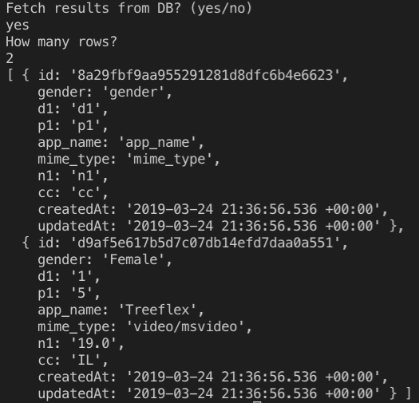

## About
csv-aggregator is a Node.js service that aggregates small compressed CSV files under `./data`  
into bigger compressed CSV files (Each file up to 1KB) under `./data/aggregated`
and reduce size by elimination of duplicated lines   
In addition, inserts new data to **SQLite** Database (`./database.sqlite`) using **Sequelize** (a promise-based ORM for Node) 

## First use
Run `npm install && npm start`

## Read from Database
After the aggregation process will finish, the application will ask the user if to fetch rows from DB, and if yes, how many rows   

## The Implementation
This solution considered high scale and performance, and because of that i decided to use
**Node.js streams**, through all the process - from reading the small csv file until saving the data to disc & DB
